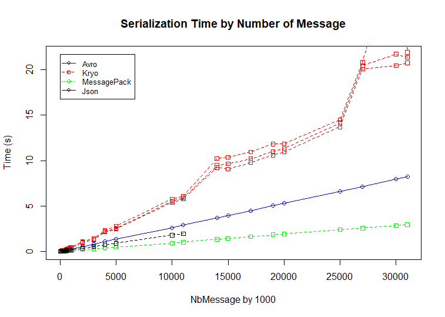

# MessagePacking
Study of solution for pack message

4 candidates :
  - JSON
  - Avro
  - Kryo
  - MessagePack

The same object for all.

Avro a good compromise with schema/validation/ ... features.

## Compare Size

## Compare Read Time

## Compare Read Time

# Links
- https://github.com/eishay/jvm-serializers/wiki
- https://google.github.io/flatbuffers/flatbuffers_benchmarks.html
- http://amzn.github.io/ion-docs/
- https://github.com/topics/data-serialization
- http://www.disciplinedagiledelivery.com/agility-at-scale/data-management/

# Issues in forward/backward

Order The association relation The specialization relation
1 Design Pattern 1 :A conflict between attribute definitions
  Design Pattern 5 :A conflict between subtype definitions
  Design Pattern 2 :A n attribute shared by two entities in a chained relationship
  Design Pattern 3 : Entities in a bidirectional association relationship
  Design Pattern 9 :A conflict between the subtype relation and the association relation
2 Design Pattern 10 :The attribute data type conflict
  Design Pattern 6 :A duplicate subtype relation
  Design Pattern 11 :A conflict between simple attribute types
  Design Pattern 12 :A conflict between existential constraints
3 Design Pattern 4 : Optional vs. mandatory relations
4 Design Pattern 7 : A conflict between attributes of a supertype and attributes of its subtypes
  Design Pattern 8 : Generalization

$ sbt run -J-Xmx2G

# License
See LICENSE file

Copyright 2018 [Buisson Diaz Conseil](http://www.buissondiaz.com)
 
Licensed under the Apache License, Version 2.0 (the "License")
